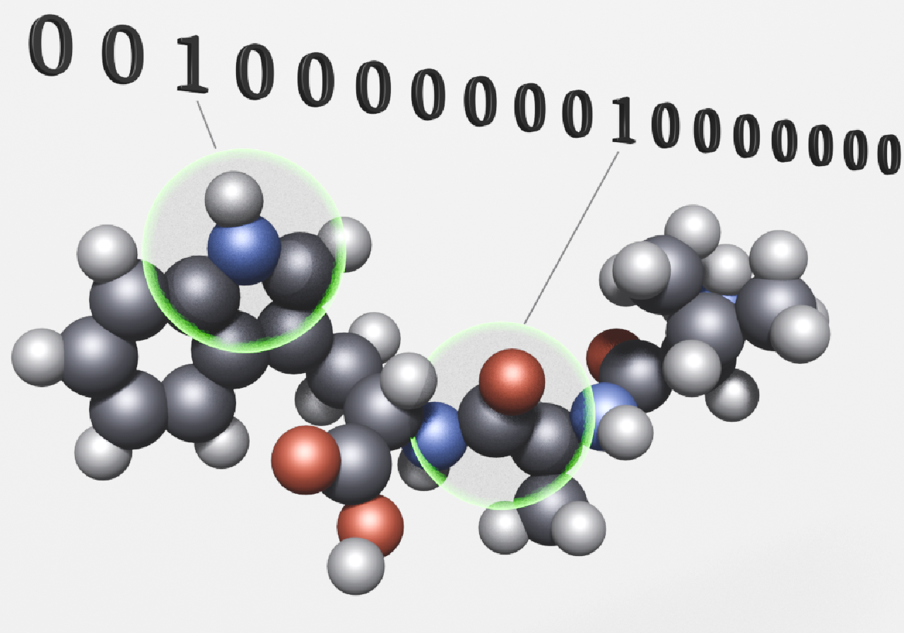

```{r setup_chunks, include=FALSE}
knitr::opts_chunk$set( echo = TRUE, message=FALSE, warning=FALSE, dpi=150)
```

# Introduction

How many chemical compounds are known today? And how can we predict the properties and find common patterns for those that will be obtained in the future?   
There are millions of synthesized and natural molecules, [cas.org](<https://www.cas.org/cas-data/cas-registry>) contains data on more than 200 million compounds, 75 million protein and nucleic acid sequences [@cas]. Estimates of the virtual chemical universe for organic molecules are even larger and continue to grow year after year [@Blum; @Ruddigkeit].   
Thus, encoding an infinite number of chemical structures using simple predictors such as chemical fingerprints allows machine learning algorithms to be applied to the large data sets.  
In this project we use the [polymers]{.data_name} dataset from [kaggle.com](<https://www.kaggle.com/datasets/victorsabanzagil/polymers/data>). The data contains Morgan fingerprints for polymers of three classes: *plastics*, *peptides*, and *oligosaccharides*. Plastics are synthetic polymers such as polyethylene, polyvinyl chloride, polystyrene, etc. Peptides and oligosaccharides can be natural or synthetic with peptide and glycosidic bonds respectively [@Giustozzi; @Young].  
  
{.img_style}
Morgan fingerprint represents the chemical structure of the molecule, also called descriptor, and is in the form of a binary vector. The values of vector indicate the pretense ([1]{.value_name}) or absence ([0]{.value_name})  of the predefined chemical substructure, within a circular radius [@Yang; @Morgan; @Lo].  
In cheminformatics, various types of chemical fingerprints, including Morgan fingerprints, are used to predict certain properties of molecules and find patterns in large data sets [@Yang]. The properties of substances are directly related to their chemical structure, so these are closely related concepts.  
  
  The *goal of this project* is to build a classification model based on Morgan fingerprint data to predict the type of the polymers.  

  The first part is to find out what types of polymers are present in this dataset using unsupervised learning algorithms and the [rcdk]{.package_name} package, which is used to work with chemical structures.  
Although labels already exist for three types of polymers  - *plastics*, *peptides* and *oligosaccharides* - these are general names for polymers and can include very different groups of polymers. Therefore, we will add polymer subtypes to the existing labels.  
  
  The second part is to find the best model that can be used to classify polymer types. For this purpose, we will use supervised machine learning methods, where the target variable will contain the polymer types that were identified in the first part, and we will use Morgan fingerprints as features.

<hr style="border:0.8px solid #E0E5E5">

# Libraries

Libraries used in this project:  
∘ [dplyr]{.package_name} and [tidyr]{.package_name} for the data manipulation;  
∘ [here]{.package_name} to set the path to the files;  
∘ [ggplot2]{.package_name}, [patchwork]{.package_name},[dendextend]{.package_name}, and [gt]{.package_name} for visualization;  
∘ [rcdk]{.package_name} is for chemical structures;  
∘ [stringr]{.package_name} to deal with strings;  
∘ [caret]{.package_name},  [rpart]{.package_name} and [ranger]{.package_name} to build the models;  
∘ [parallelDist]{.package_name} for distance calculations.

```{r libraries}
library(dplyr)
library(tidyr)
#library(here)
library(rcdk)   
library(stringr)
library(ggplot2)
library(dendextend)
library(patchwork)
library(gt)
library(caret)
#library(parallelDist)
library(rpart)
library(ranger)
```


```{r settings }

# Load functions 

# Function for table visualization. Converts data frame 
# into a gt_tbl table (gt package)
source(here::here("scripts/functions/print_gt_table.R"))

#  Print molecules. Using rcdk and grid packages
source( here::here("scripts/functions/print_molecules.R"))

# Colors

saccharides_color <- c("#C24641", "#A74AC7","#F2A2E8", "#FC6C85")
plastics_color <-  c("#E0E5E5","#52595D", "#C0C6C7",  "#99A3A3")
peptides_color <- c("#1F45FC", "#0AFFFF", "#43C6DB" , "#357EC7")

point_color <-"#5F9EA0"
hist_color <- c("#A0CFEC", "#52595D")
title_color = "#708090"

# Plots theme

themes <- theme_light(base_size = 10 ) + 
  theme(plot.title = element_text(size = rel(1.2), family = "system-ui", color = title_color),
        axis.title = element_text( size = rel(1.1)))
```

<hr style="border:0.8px solid #E0E5E5">

# Data overview   

```{r read_file}
# Load data 

# The original file 'polymers_dataset.csv' is not included in
# this repository, but it is available at
# https://www.kaggle.com/datasets/victorsabanzagil/polymers/data

# File 'polymers_dataset.csv' was converted to rds format 
# to reduce the size.

# So the data for this project is in the file 'data/raw/polymers_data.rds'. 
# The folder 'data' needs to be in the project working directory,
# then it can be loaded as:

polymers <- readRDS(here::here("data/raw/polymers_data.rds"))
```

The [polymers]{.data_name} data set contains data for 20609 polymers. 

```{r rows}
nrow(polymers)
```

There is no missing values in this dataset.
```{r check_missing}
sum(is.na(polymers))
```

First 3 columns:

|||
|-|---|
| [X]{.column_name}       | integer, row ID       |
| [smiles]{.column_name}  | character, chemical structure representation |
|  [label]{.column_name}  | character, polymer type |
|||


```{r first_3_columns}
str(polymers[ , 1:3])
```

## label  
The variable [label]{.column_name} is one of three types of polymer: *plastic*, *peptide*,  or *oligosaccharide*. The values in this column  are distributed approximately evenly.


```{r}
table(polymers$label)
```

## smiles

The [smiles]{.column_name} column represents the chemical
structure of the polymers as SMILES 
(Simplified Molecular Input Line Entry System [@Weininger]).
All values in the [smiles]{.column_name} column are
unique character strings.

```{r is_smiles_unique}
length(unique(polymers$smiles)) == nrow(polymers)
```

 Here are examples of "smiles" for all three types of the polymers.

```{r smiles_example}
polymers %>%
  mutate(length = nchar(smiles)) %>%
  arrange(length) %>%
  group_by(label) %>%
  summarise(first(smiles)) %>% 
  pull()
```

It should be noted here that polymers are large macromolecules consisting of repeating
chemical structures - *monomers*, and contain from thousands to millions of atoms [@Young].

In this data set, we're dealing with these repeating units that are shown as SMILES. 

So when we look at the structure of a polymer, we're looking at the chemical structure 
of the simple unit that the polymer is made of.

## Morgan fingerprints

The Morgan fingerprints are stored in columns [X0]{.column_name}, [X1]{.column_name} ... [Xn]{.column_name} and will be used as features to predict the type of polymers. We will refer to these columns as X-variables or X columns.  There are 2048 X-variables that have two possible values [0]{.value_name} or [1]{.value_name}. 

```{r dropX}
# we omit the first column of the 'polymers' dataset: X (row identifier),
# to avoid confusion with X-variables
polymers <- polymers[ , -1]
```

```{r x_values}
#  possible values in columns Xn
polymers %>% 
  select(matches("X\\d+")) %>% 
  unlist() %>% 
  unique()
```


A value of [1]{.value_name} indicates the presence of predefined chemical structures in the molecule.
Each molecule has a very small number of structures compared to all possible ones.
 Therefore, we can expect most of each fingerprint vector to consist mostly of [0]{.value_name}s 
 and a small number of [1]{.value_name} values.

There also some chemical structures common to all or nearly all molecules.

To examine the distribution of values in the X-variables, we find the X columns sums, 
which basically show how many [1]{.value_name} values are contained in each predictor, or in other
words, how often a certain predefined chemical group appears in the polymer molecules.

```{r x_sums_histogram, fig.height=2.5}

# 'x_sums' is a vector containing the column sums for all X-variables,
# showing how many 1 values occur in each predictor.
x_sums <- polymers %>% 
  select(matches("X\\d+")) %>% 
  colSums()

# Plot the distribution of the column sums for X-variables.
data.frame(x_sums = x_sums) %>%
  ggplot(aes(x_sums)) +
  geom_histogram(fill = hist_color[1], 
                 color = hist_color[2], 
                 bins = 100) +
  labs(title = "Histogram. Sums of X-variables",
       x  = "sum") +
  themes + theme(plot.margin = unit(c(5,30,5,30), "pt"))

```

The histogram of the sums of X-variables is skewed toward low values,
indicating that the most frequent value is [0]{.value_name}. 

```{r x_sums_summary}
# Some summary for  the column sums for X-variables:
x_sums_summary <- data.frame(label = c("minimum", "maximum",
                                       "number of X colimns with all 0s",
                                       "number of X colimns with less than one hundred '1' values",
                                       "number of X colimns with more than 5K '1' values"),
                             value = c(min(x_sums),
                                       max(x_sums),
                                       sum(x_sums ==0),
                                       sum(x_sums <= 100),
                                       sum(x_sums >= 5000))) 

x_sums_summary %>%
  print_gt_table(table_title = "Sums of X-variables") %>%
  tab_options(column_labels.hidden =TRUE)
```

There are
`r x_sums_summary$value[3]` 
columns with all [0]{.value_name}s, and
`r x_sums_summary$value[4]`
predictors that contain only 100 or fewer [1]{.value_name} values.
This means that these predictors are different from 0 in only 
`r str_remove(paste(round((100/nrow(polymers))*100, 1), "%"), " ")` 
of the data.

Let's look at the sums of X-variables grouped by [label]{.column_name}.

```{r x_sum_label}
x_sum_byLabel <- polymers %>% 
  select(matches("label|X\\d+")) %>%
  select(1:101) %>%         # find the column sums for the first 90 predictors 
  group_by(label) %>%       # grouped by the variable "label";
  summarise(across(where(is.numeric), sum )) %>% 
  t() %>% as.data.frame()   # transpose the table and 

# turn the label values into column names.
colnames(x_sum_byLabel) <- unlist(x_sum_byLabel[ 1, ])
rownames(x_sum_byLabel) <- NULL

# delete 1st row which has non-numeric values ("oligosaccharide", "peptide", "plastic")
x_sum_byLabel <- x_sum_byLabel[ -1,] %>% 
  mutate(across(everything(), as.numeric)) %>%
  mutate(n = row_number()-1) %>%    # add X column names starting from X0
  mutate(Xn = str_remove(paste("X", n), " ")) 

head(x_sum_byLabel) %>% 
  select(Xn, oligosaccharide, peptide, plastic) %>%
  print_gt_table(table_title = "Sums of the first 6 X-variables by polymer type") %>% 
  cols_align("center")
```

The graph below shows the column sums for the first 100 X-variables, colored by [label]{.column_name}  (polymer type).

```{r x_sums_byLabel_plot, fig.height=2.5 }
x_sum_byLabel %>%
  ggplot(aes(n-0.3, oligosaccharide, fill = "oligosaccharide")) + 
  geom_col(width = 0.3) +
  geom_col(aes(n, peptide, fill = "peptide"), width = 0.3) +
  geom_col(aes(n+0.3, plastic, fill = "plastic"), width = 0.3) +
  scale_fill_manual(values = c(saccharides_color[1],
                               peptides_color[1],
                               plastics_color[4]),
                    labels = c("oligosaccharide", "peptide", "plastic")) +
  
  labs(title = "Sums of X-variables by polymer type",
       x  = "X",
       y = "sum") +
  themes +
  theme(legend.position = "inside",
        legend.position.inside = c(.35, .95),
        legend.justification = c("right", "top"),
        legend.title = element_blank(),
        plot.margin = unit(c(5,10,5,10), "pt") ) 
```

We can notice that some X-variables have a large number of [1]{.value_name}s for all three polymer types, while others are specific only to oligosaccharides, peptides, or peptide+plastic.

<hr style="border:0.8px solid #E0E5E5">

# Polymers types

Plastic, peptide, and oligosaccharide are just general names for large groups of chemicals that may include many subtypes. Furthermore, there are different ways to classify polymers. 


To find out what types (and how many types) of polymers are present in our data, we:  
∘ determine the structure of the polymers that are represented in [smiles]{.column_name}, and  
∘ use Morgan fingerprints for unsupervised learning methods to find polymer groups that are not obvious from the [smiles]{.column_name} variable. 

## rcdk

We will now use the [rcdk]{.package_name} package to look at the chemical structure of the polymers in more detail and add variables that will help us create more labels for classification.

### Molecular weight

To find the molecular weight (Mw) from SMILES, we first convert the "smiles" to "molecules" using the [parse.smiles()]{.function_name} function

```{r smiles_to_molecules}
# convert the "smiles" to "molecules"
molecules <- parse.smiles(polymers$smiles)
class(molecules[[1]])
```

then use [get.exact.mass()]{.function_name}.

```{r molecular_weight}

# The output of the parse.smiles() is a list of "molecules", 
# so we use the sapply() function to get the molecular weight 
# using the get.exact.mass() function.
polymers_Mw <- sapply(molecules, get.exact.mass) %>% unlist()
names(polymers_Mw) <- NULL

# The new variable Mw will be used to find the smallest molecules
# when we need to print the examples of molecular structures.
polymers <- cbind(Mw = polymers_Mw, polymers)

# Molecular weight range of polymers:
polymers %>% 
  group_by(label) %>%
  summarise(Mw_min = round(min(Mw)),
            Mw_max = round(max(Mw))) %>%
  print_gt_table(table_title = "Molecular weight") %>%
  tab_spanner(label = "Mw", columns = starts_with("Mw")) %>%
  cols_label(Mw_min	= "min",
             Mw_max	= "max") %>%
  cols_align("center")
```

### Aromacity

The presence of aromatic groups has a great impact on the properties of polymers. Therefore one way to add more detail to the classification of polymers is to find which polymers have aromatic functional groups, for this purpose we use the [do.aromaticity()]{.function_name} function to add a new variable [is_aromatic]{.column_name}.

```{r aromaticity}

# The output of the do.aromaticity() function is a boolean value 
# indicating any aromatic ring in the chemical structure.
polymers_aromaticity <- sapply(molecules, do.aromaticity) %>% unlist()
names(polymers_aromaticity) <- NULL

polymers <- cbind(is_aromatic = polymers_aromaticity, polymers)

# Proportions of polymers with aromatic groups:
polymers %>% 
  group_by(label) %>%
  summarise(aromatic_prop = mean(is_aromatic)) %>%
  print_gt_table(table_title = "Aromatic molecules in the dataset") %>%
  fmt_percent(columns = aromatic_prop, rows = everything(), decimals = 1) %>%
  cols_label(aromatic_prop	= "percent") %>%
  cols_align("center")
```

More than half of the plastics and peptides have the aromatic group.


### Heteroatoms 

Atoms in structures other than carbon and hydrogen are called *heteroatoms*. These atoms are part of functional groups that lead to various properties of molecules. The polymers in these data have the following heteroatoms:

```{r heteroatoms}
# To find out what atoms are present in a molecule, we first need to get
# the atoms using the get.atoms() function, and then use another function,
# get.symbol(), to extract the symbols of the elements.

sapply(molecules, function(mol){
     unique(unlist(sapply(get.atoms(mol ), get.symbol)))
   }) %>% unlist() %>% unique() %>%
   setdiff( c("C", "H"))
```

We expect all peptides to have nitrogen (N) and oxygen (O), and all oligosaccharides to have oxygen (O) in all cases.  
The proportions of polymers that have elements other than C and H are as follows:

```{r heteroatoms_percent}

# Proportions of polymers with heteroatoms:
heteroatoms <- polymers %>%
  select(label, smiles) %>% 
  group_by(label) %>%
  summarise(Cl = mean(grepl(".*Cl.*" , smiles)),
            O = mean(grepl(".*O.*" , smiles)),
            N = mean(grepl(".*N.*" , smiles)) ,
            S = mean(grepl(".*S.*" , smiles))) %>%
  ungroup()

heteroatoms %>%
  print_gt_table(table_title = "Heteroatoms") %>%
  fmt_percent(columns = c(Cl,O,N,S), rows = everything(), decimals = 1) 
```

**Oligosaccharides**. 
`r str_remove(paste( round(heteroatoms$N[which(heteroatoms$label == "oligosaccharide")]*100,1), "%"), " ")`
of oligosaccharides have nitrogen. Let's see what groups with nitrogen we have here.

```{r oligosaccharide_smiles}

#  find unique patterns of about 30 characters long 
# containing "N" for oligosaccharides and corresponding "smiles"
oligosaccharides <-polymers %>% 
  select(Mw, label, smiles) %>%
  filter(label == "oligosaccharide") %>%
  mutate(pattern_nitrogen = str_extract(smiles, ".{0,15}N.{0,15}")) %>%
  filter( !is.na(pattern_nitrogen)) %>%
  arrange(Mw) %>%
  group_by(pattern_nitrogen) %>%
  summarise(smiles = first(smiles))

oligosaccharides$pattern_nitrogen
```

In the [smiles]{.column_name} we can see 5 unique patterns with nitrogen, from the following molecules:

```{r oligosaccharide_structures, fig.height=3}

# Chemical structures that correspond to each of the unique
# patterns with "N" that are present in the  "smiles" for oligosaccharides.
 print_molecules(smiles = oligosaccharides$smiles)
```

All patterns correspond to saccharides with amino groups [@Bhagavan] and amine-linked saccharides [@Akhtar].

**Peptides**. 
`r str_remove(paste( round(heteroatoms$S[which(heteroatoms$label == "peptide")]*100,1), "%"), " ")`
of peptides contain sulfur. These proteins may contain methionine, cysteine, homocysteine, 
 or taurine in their structure [@Brosnan].

**Plastics**. 
`r str_remove(paste( round(heteroatoms$Cl[which(heteroatoms$label == "plastic")]*100,1), "%"), " ")`
of the plastics contain chlorine, 
 `r str_remove(paste( round(mean(polymers$is_aromatic[which(polymers$label == "plastic")])*100,1), "%"), " ")`
 contain aromatic groups. Thus, it can be concluded that in this dataset, “plastics” are a type of polymer that have carbon-carbon bonds in the main chain and Cl-, aliphatic or aromatic groups as side groups.  
  
  In this step, we add a new target variable [type]{.column_name} that will have new labels for the polymers:  
∘ for oligosaccharides, we add labels indicating the presence of an amino group and/or an amine linkage between two sugars;  
∘ for peptides -  the presence of sulfur;  
∘ for plastics - the presence of chloro- and/or aromatic groups;

```{r types}
polymers <- polymers %>%
  mutate(type = case_when(
    label == "oligosaccharide" & grepl(".*N$|.*1N.*" , smiles) ~  "saccharide_amino",
    label == "oligosaccharide" & !grepl("*N$|.*1N." , smiles) ~  "saccharide",
                         
    label == "peptide" & grepl(".*S.*" , smiles) & !is_aromatic ~  "peptide_sulfur",
    label == "peptide" & !grepl(".*S.*" , smiles) & !is_aromatic ~  "peptide",
    label == "peptide" & grepl(".*S.*" , smiles) & is_aromatic ~  "peptide_sulfur_aromatic",
    label == "peptide" & !grepl(".*S.*" , smiles) & is_aromatic ~  "peptide_aromatic",
                         
    label == "plastic" & !grepl(".*Cl.*" , smiles) & is_aromatic ~  "plastic_aromatic",
    label == "plastic" & grepl(".*Cl.*" , smiles) & !is_aromatic ~  "plastic_chloro",
    label == "plastic" & !grepl(".*Cl.*" , smiles) & !is_aromatic ~  "plastic_aliphatic",
    label == "plastic" & grepl(".*Cl.*" , smiles) & is_aromatic ~  "plastic_chloro_aromatic") ) %>%
  
  mutate(type = ifelse(label == "oligosaccharide" & grepl(".*N\\[C@.*" , smiles),
                       str_c(type, "_amineLinked"), type)) %>%
  relocate(type, .after = label)
```


```{r types1_plot, fig.height=2.5 }

# Distribution of new labels for polymers
polymers %>% 
  ggplot(aes(y = type)) +
  geom_bar(fill = hist_color[1], color = hist_color[2]) + 
  ggtitle("Types of the polymers") +
  themes + theme(plot.margin = unit(c(5,20,5,30), "pt"))
```


##  PCA 
 
For high-dimensional data, we can use principal component analysis (PCA) and 
see how our polymer types are separated by the first few principal components.

This will allow us to visualize features of the data and find the patterns
having a lot fewer data dimensions, as well as give us  new clues about 
the grouping of polymers into subtypes.

To perform PCA, we use the [prcomp()]{.function_name}
function and print a subset of the results along with the polymer types,
and build scree plots.

```{r PCA_model}
pca_model <- polymers %>% 
  select(matches("X\\d+")) %>%
  prcomp()

bind_cols( label = polymers$label,  pca_model$x[ , 1:5]) %>%
  slice_head(n = 6) %>%
  print_gt_table(table_title = "The first five principal components",
                 col_padding = 10)
```


```{r variance_explained, fig.height=2.5}

# The proportion of variance explained by each principal component 
variance_explained <- tibble(ve = pca_model$sdev^2/sum(pca_model$sdev^2),
                             PC = 1:length(pca_model$sdev))

# Vector of cumulative proportion of variance explained  
cumulat_variance_explained <- cumsum(variance_explained$ve)

# Number of the PCS that explain 90% of the variance in the data,
# is used for the scree plots to limit the number of the PCs
nPCs_variance_90 <- which(cumulat_variance_explained >= 0.9)[1]

# Scree plots. 
p1 <- variance_explained[1:nPCs_variance_90 ,] %>%
  ggplot(aes(PC, ve)) +
  geom_point(color = point_color, size = 1.5) +
  labs(title = "254 principal components",
       x  = "principal component number",
       y = "variance explained") +
  themes + theme(plot.margin = unit(c(5,5,5,5), "pt") ) 

p2 <- variance_explained[1:25 ,] %>%
  mutate(cve = cumsum(ve)) %>%
  ggplot(aes(PC, cve)) +
  geom_point(color = point_color, size = 1.5) +
  labs(title = "25 principal components",
       x  = "principal component number",
       y = "cumulative variance explained") +
  themes +  theme(plot.margin = unit(c(5,5,5,20), "pt") ) 

p1 + p2 + plot_annotation("Scree plots", 
                          theme = theme(plot.title = element_text(size = 12)))
```

The plot on the left shows the proportion of variance explained for `r nPCs_variance_90` principal components that capture 90% of the information in this data.

The plot on the right is the cumulative proportion of explained variance for the first 25 principal components. The first two PCs explain just over 30% of the variance.

Next, we show scatter plots of the principal components and color by polymer type.Given that the first two principal components explain about 1/3 of the variance in the data, we expect that adding more principal components will also be useful in finding out if there are more polymer groups than we have already detected.
 
```{r PC_plots}
pca_results <- bind_cols(Mw = polymers$Mw,
                        label = polymers$label,
                        type = polymers$type, 
                        smiles = polymers$smiles,
                        pca_model$x[ , 1:10])

# Scatter plots:
theme_PC <- ggplot() +
  scale_color_manual(values = c(peptides_color, plastics_color, saccharides_color)) +
  themes

p1 <- theme_PC + 
  geom_point(data = pca_results, aes(PC1, PC2, colour = factor(type)),shape = 1) 

p2 <- theme_PC +
  geom_point(data = pca_results, aes(PC4, PC10, colour = factor(type)),shape = 1)
  
p3 <- theme_PC + 
  geom_point(data = pca_results, aes(PC4, PC2, colour = factor(type)),shape = 1) 

p4 <- theme_PC +
  geom_point(data = pca_results, aes(PC3, PC6, colour = factor(type)),shape = 1) 

p1 + p2 + p3 + p4 + 
  plot_layout(ncol = 2, guides = "collect") & 
  theme(legend.position = "bottom", legend.title = element_blank()) 
```

In these graphs, all peptides are colored blue (from light blue to dark blue), saccharides are red/purple, and plastics are gray. The first two principle components are enough to separate original three [labels]{.column_name}. Plastics and oligosaccharides form groups according to the types we have already defined. However, there should be more peptide groups, from 3 to 4-5.

## Hierarchical cluster analysis 

Now let's apply another algorithm to find out which groups of peptides might be present in the data.

There are some discussions on the application of kmeans and the hierarchical clustering algorithm to binary data. Hierarchical clustering with Ward and "centroid" methods based on Euclidean distances is not suitable for binary data [@Scheuch; @stackexchange1; @stackexchange2].

Therefore, we will use hierarchical cluster analysis using the method "average", and to calculate distances we set the method to "binary".

```{r hclust_results}
polymers_matrix <- polymers %>%                        # We convert
   select(matches("X\\d+")) %>% as.matrix()            # X-variables to matrix,
dists <- parallelDist::parDist( polymers_matrix,  method = "binary") # find Jaccard distances, and 
model_hclust <- hclust(dists, method = "average")      # build hierarchical clustering model.
```

Reduce the number of clusters to 12,
```{r cut_hclust}

# Cut hclust tree into 12 clusters
cut_model_hclust <- cutree(model_hclust, 12)

# we add "label" and "type" variables to clusters
hclust_results <- tibble(label = polymers$label,
                         type = polymers$type,
                         cluster = cut_model_hclust)
```

and check how the clusters are distributed across the polymer types:

```{r hclust_table}

# Print a table  with the results of hierarchical clustering, color by label.
hclust_results %>%
  mutate(cluster = as.character(cluster)) %>%
  group_by(cluster, type) %>%
  summarise(n = n()) %>%
  ungroup() %>%
  arrange(type) %>%
  pivot_wider(names_from = type, values_from = n) %>%
  print_gt_table(table_title = "Distribution of the clusters by type of the polymers",
                 col_padding = 4) %>%
  tab_spanner(label = md('<span style="color:#FC6C85;">saccharides</span>'),
              columns = starts_with("sacch")) %>%
  tab_spanner(label = md('<span style="color:#1F45FC;">peptides</span>'), 
              columns = starts_with("pept")) %>%
  tab_spanner(label = md('<span style="color:#52595D;">plastics</span>'), 
              columns = starts_with("plas")) %>%
  cols_label(saccharide	= "carbohydrate",
             saccharide_amino = "amino",
             saccharide_amineLinked = "amine-linked",
             saccharide_amino_amineLinked = "amino/amine-linked",
             peptide = "aliphatic",
             peptide_sulfur = "sulfur",
             peptide_aromatic = "aromatic",
             peptide_sulfur_aromatic = "sulfur/aromatic",
             plastic_aliphatic = "aliphatic",
             plastic_chloro = "chloro",
             plastic_aromatic = "aromatic",
             plastic_chloro_aromatic = "chloro/aromatic") %>%
  sub_missing(columns = everything(), rows = everything(), missing_text = "-") %>%
  data_color(columns = starts_with("sacch"), palette = saccharides_color[1], apply_to = "text") %>% 
  data_color(columns = starts_with("pept"), palette = peptides_color[1], apply_to = "text") %>%
  data_color(columns = starts_with("plas"), palette = plastics_color[4], apply_to = "text") %>%
  cols_align("center") 
```

Although we can separate the original polymer labels, the same clusters include different types of polymers, especially for peptides; we observed similar results for PCA.  
  
This can be visualized using a dendrogram:
```{r hclust_dendrogram, fig.height=5}
# Change the hclust model to "dendrogram" and cut at height 0.787 to have 12 clusters.
dendrogram <- model_hclust %>% as.dendrogram() %>% cut( h = 0.787)
dendrogram <- dendrogram$upper

# To add the correct labels, we get the dendrogram attribute that shows the 
# number of cases in the nodes ("x.member"), then filter only the values that 
# correspond to leaf nodes (the "members" attribute is equal to 1). Then compare
# with the number of cases for each cluster in the "hclust_results" table.
n <- dendextend::get_nodes_attr(dendrogram, "members")
x_member <- dendextend::get_nodes_attr(dendrogram, "x.member")
label_dendrogram  <- data.frame(i = 1:12,
                                branch = labels(dendrogram),
                                x_member = x_member[which(n == 1)])

cluster_dendrogram <- hclust_results %>% group_by(cluster) %>%
  summarise(x_member = n(), types = toString(unique(type))) %>%
  left_join(label_dendrogram, by = "x_member") %>%
  arrange(i) %>%
  mutate(label_color = case_when(
    str_starts(types, "sacch") ~ saccharides_color[1],
    str_starts(types, "pept") ~ peptides_color[1],
    str_starts(types, "plast") ~ plastics_color[2]))

labels(dendrogram) <- cluster_dendrogram$types

dendrogram %>%
  set("labels_col", cluster_dendrogram$label_color) %>%
  set("labels_cex", 0.7) %>%
  plot( horiz = TRUE, main = "Dendrogram")
```

The dendrogram can also give us an idea of which type of polymers have a more similar structure.  
  
  We can use the results of cluster analysis to find additional features of chemical structures within the same polymer types. To do this, we draw examples of molecules by clusters.

```{r peptides_clusters}
# We want to display the peptide molecules with the lowest molecular weight, 
# so we add the variable "Mw".
hclust_results <- bind_cols(hclust_results , 
                            Mw = polymers$Mw, 
                            smiles = polymers$smiles)

#  clusters for peptides only:
clusters <- unique(hclust_results$cluster[which(hclust_results$label == "peptide")])

# filter out peptide clusters with low counts and keep 3 instances for each cluster
peptides <- hclust_results %>%
  filter(cluster %in% clusters) %>%
  group_by(cluster) %>%
  filter(n() > 20) %>%
  arrange(Mw) %>% 
  slice_min(Mw, n =3, with_ties = FALSE)

smiles <-  peptides %>% pull(smiles)

print_molecules(smiles = smiles, row_labels = clusters, prefix = "cluster ")
```
 
**Peptides**. 
There are three interesting clusters of peptides, all of which contain the same functional groups found in amino acids: histidine (His), tryptophan (Trp), and proline (Pro).


One way to find these groups is to use the [rcdk]{.package_name} package. There are functions that extract fragments ([get.murcko.fragments()]{.function_name} and [get.exhaustive.fragments()]{.function_name} ), but applying them to the dataset will take a long time. So we will use the [stringr]{.package_name} package to find patterns in the [smiles]{.column_name}.  

As we can see, these groups have cycles. In SMILES, cyclic structures are enclosed in parentheses and have numbers indicating the ring.

```{r ring_patterns1}
ring_patterns <- unique(str_extract(smiles, "\\([CN=12]+\\d[CN=12]*\\)" ) )
ring_patterns
```

```{r ring_patterns2}
# tryptophan has two rings, there has to be "2" in the pattern
Trp <- ring_patterns[which(str_detect(ring_patterns, "2"))]

# histidine has two nitrogens
His <- ring_patterns[which(str_count(ring_patterns, "N") == 2)]

# proline is not aromatic, so there is no double bonds
Pro <- ring_patterns[which(str_detect(ring_patterns, "=", negate = TRUE))]
```


```{r peptides_3molecules, fig.height=2.5}

# Show examples of molecules from clusters 5, 6 and 7
par(mfrow = c(1,3))
print_molecules(peptides$smiles[which(str_detect(smiles, Trp))][1], layout = 1)
symbols(x = 67, y = 72, circles = 75, lwd = 2, add = TRUE, inches = FALSE, fg = "#8EEBEC") 
text(x = 60, y = 280, paste("claster = ", peptides$cluster[which(str_detect(smiles, Trp))][1]))

print_molecules(peptides$smiles[which(str_detect(smiles, His))][1], layout = 1)
symbols(x = 40, y = 115, circles = 45, lwd = 2, add = TRUE, inches = FALSE, fg = "#8EEBEC") 
text(x = 60, y = 280, paste("claster = ", peptides$cluster[which(str_detect(smiles, His))][1]))

print_molecules( peptides$smiles[which(str_detect(smiles, Pro))][1], layout = 1)
symbols(x = 135, y = 52, circles = 55, lwd = 2, add = TRUE, inches = FALSE, fg = "#8EEBEC") 
text(x = 230, y = 280, paste("claster = ", peptides$cluster[which(str_detect(smiles, Pro))][1]))
```

Thus, cluster
`r peptides$cluster[which(str_detect(smiles, Trp))][1]` 
shows peptides with tryptophan, 
cluster 
`r peptides$cluster[which(str_detect(smiles, His))][1]` 
shows peptides with histidine,  and
cluster
`r peptides$cluster[which(str_detect(smiles, Pro))][1]` 
shows peptides with proline.  

We add this information to the polymer types and look at the distribution of these functional groups in the data:

```{r peptide_func_groups}

# add logical variables indicating the presence of functional groups
polymers <- polymers %>%
  mutate(is_Trp = str_detect(smiles, Trp),
         is_His = str_detect(smiles, His),
         is_Pro = str_detect(smiles, Pro))

# proportions of functional groups of the peptides
multiple_func_groups <- polymers %>%
  filter(label == "peptide") %>%
  mutate(func_groups_count = is_Trp  + is_His + is_Pro) %>%
  pull(func_groups_count)

table(multiple_func_groups)
```

Most peptides have none or one of these functional groups, but some have two or all three.

```{r add_peptide_types}

# We add the names of the corresponding functional groups to the peptide types.
polymers <- polymers %>%
  mutate(type = ifelse(is_Trp, str_c(type, "_Trp"), type)) %>%
  mutate(type = ifelse(is_His, str_c(type, "_His"), type)) %>%
  mutate(type = ifelse(is_Pro, str_c(type, "_Pro"), type))
```

**Plastics**. We can look at the "plastics" as well.

```{r print_molecules_plastic, fig.height=3}

# 'plastics' clusters:
clusters <- unique(hclust_results$cluster[which(hclust_results$label == "plastic")])

smiles <- hclust_results %>%
  filter(cluster %in% clusters) %>%
  group_by(cluster) %>%
  arrange(Mw) %>% 
  slice_min(Mw, n =3, with_ties = FALSE) %>%
  pull(smiles)

print_molecules(smiles = smiles, row_labels = clusters, prefix = "cluster ")
```

Cluster 1 corresponds to aromatic polymers, and clusters 4 and 9 to aliphatic polymers.

**Oligosaccharides**. Most oligosaccharides are found in one cluster.
Therefore, we will not add any other subtypes for plastics and oligosaccharides.

Here are the final polymer types that will be used for classification in the target variable [type]{.column_name}.

```{r types2_plot, fig.height=3 }

# Distribution of new values in the variable "type"
polymers %>% 
  ggplot(aes(y = type)) +
  geom_bar(fill = hist_color[1], color = hist_color[2]) + 
  ggtitle("Types of the polymers") +
  themes + theme(plot.margin = unit(c(5,20,5,30), "pt") ) 
```

<hr style="border:0.8px solid #E0E5E5">

# Data preparation

## Select features
As features we will use Morgan fingerprints stored in X columns.
There are 
`r sum(x_sums <= 100)` 
out of 
`r length(x_sums)` 
X columns with less than 100 of [1]{.value_name} values. 

These predictors are different from 0 in
`r str_remove(paste(round((100/nrow(polymers))*100, 1), "%"), " ")` 
of the data; therefore we filter out these variables.

```{r x_sums_0s}

# The first 6 sums of X columns; for example, in column X0 
# there are only 5 values of "1" out of 20609
head(x_sums)

# Names of X-variables that have more than one hundred '1' values 
# that will be used in the training set
ind_x <- which(x_sums >100)
ind_x <- which(colnames(polymers) %in% names(ind_x))
```


## Split data

We split data to train set and test set and change the target variable, [type]{.column_name}, to *factor*.

The [createDataPartition()]{.function_name} function from [caret]{.package_name} partitions the data so that the training and test sets have similar proportions of target variable values.

```{r split_data}
#                       split data
set.seed(1)       # indexes for the training set:
index <- createDataPartition(y = polymers$type, 
                             times = 1, p = 0.8, 
                             list = FALSE)

#       train set
train_x <- polymers[ index, ind_x] 

train_type <- polymers[ index, ] %>% 
  select(type) %>%
  mutate(type = factor(type))

#      test set
test_x <- polymers[ -index, ind_x] 

test_type <- polymers[ -index, ] %>% 
  select(type) %>%
  mutate(type = factor(type))
```


```{r train_predictors_subset}
train_x[1:5, c(1:3, (ncol(train_x)-3):ncol(train_x) )] %>%
  print_gt_table(table_title = "The first and the last predictors",
                 col_padding = 15) %>%
  cols_align("center")
```

<hr style="border:0.8px solid #E0E5E5">

# Models
First, we compare three different algorithms with default settings, then based on the results we select the best one and adjust the parameters for this model.

## Model selection
We try three classical algorithms that can be applied to our data.  

&#127969;<span style="font-size:9pt;">&#127969;</span>
**K-nearest neighbors** (**kNN**). For this model, we use the [knn3()]{.function_name} function from [caret]{.package_name}, by default it has *k = 5* for classification.


```{r knn_model}
# kNN
knn_model <- knn3(type ~ . ,
                  data = bind_cols(train_type, train_x))
knn_model$k
```

&#127795; **Classification tree**. To fit this model, we use [rpart()]{.function_name} function from the [rpart]{.package_name} package.  

```{r rpart_model}
# classification tree
rpart_model <- rpart(type ~ . ,
                     method = "class",
                     data = bind_cols(train_type, train_x))

unlist(rpart_model$control)
```

<span style="font-size:10pt;">&#127795;</span>&#127794;&#127795; **Random forest**. The [ranger]{.package_name} package allows us to quickly compute a random forest model.

We also want to estimate a variable importance; this can be done by setting the *importance* parameter to 'impurity_corrected'.  
From [ranger()]{.function_name} manual: "'impurity_corrected' importance measure is unbiased in terms of the number of categories and category frequencies ...". This is our case.

```{r ranger_model}
# random forest
ranger_model <- ranger(type ~ . ,
                       data = bind_cols(train_type, train_x),
                       seed = 1,
                       importance = "impurity_corrected")

ranger_model
```

### Compare results

We will use accuracy as a metric to evaluate the performance of the models.

```{r accuracy_3_models}
knn_predicted <- predict(knn_model, test_x, type = "class")

rpart_predicted <- predict(rpart_model, test_x, type = "class")

ranger_predicted <- predict(ranger_model, test_x)

data.frame(knn = round(mean(knn_predicted ==  test_type$type),4),
           rpart = round(mean(rpart_predicted ==  test_type$type),4),
           ranger = round(mean(ranger_predicted$predictions ==  test_type$type),4) ) %>%
  print_gt_table(table_title = "Polymer type prediction accuracy for models with default settings") %>%
  cols_label(knn = "kNN",
             rpart = "classification tree",
             ranger = "random forest") %>%
  cols_align("center")
```

The random forest model provides the highest accuracy, so we will focus on this model.

## Random forest

Random forest is a powerful classification algorithm that performs better than classification tree and kNN models in most cases. Even with default settings, it shows high accuracy. Next, we will try to reduce the number of predictors and find a better mtry parameter. This will reduce the computation time and further improve the accuracy.

### Variable importance

Before tuning the model parameters, let's first consider the *variable importance*, which was estimated by the [ranger()]{.function_name} function and can be found in its output.

```{r variable_importance, fig.height=2.5}

# Variable importance table: variables with higher importance 
# are at the beginning with lower indices n.
variable_importance <- 
  data.frame(x = names(ranger_model$variable.importance),
             importance = ranger_model$variable.importance) %>%
  arrange(desc(importance)) %>%
  mutate(n = row_number()) 

# Variable importance plot.
variable_importance %>%
  ggplot(aes(n, importance)) +
  geom_point(color = point_color, size = 1.5) + 
  ggtitle("Variable importance")  + 
  themes + theme(plot.margin = unit(c(5,60,5,80), "pt"))
```

We can reduce the number of X-variables and use fewer predictors, which will allow us to calculate the optimal model parameters faster.

```{r variable_importance_cutoff}

# We use an arbitrary limit on the number of predictors to keep:
# we drop variables that have less than 5% of the maximum 
# variable importance value.
ind_x_importance <- variable_importance %>%
  filter(importance > max(variable_importance$importance)*0.05) %>% pull(x)

length(ind_x_importance)
```

### mtry

*mtry* is a number of variables to split at in each node. Default is the square root of the number variables. In our first random forest model, this number was `r ranger_model$mtry`, which is close to the square root of the number of X variables we used in the training set.

```{r mtry35}
sqrt(ncol(train_x))
```

But now we have fewer predictors, we need to keep that in mind and include *mtry* values around this value:

```{r mtry7}
sqrt(length(ind_x_importance))
```

We also reduce the number of trees to save computation time.

```{r tune_ranger_model, fig.height=2.5}

# Keep only predictors with high variable importance:
train_x <- train_x[ , ind_x_importance]

# Find the optimal mtry: we reduce the number of trees to save computation time;
# find the accuracy for the test set along with the out-of-bag prediction error
tune_mtry <- sapply(round(seq(-10, 10, 2)+ sqrt(length(ind_x_importance))),
                    function(i){
  ranger_tune = ranger(type ~ . ,
                      data = bind_cols(train_type, train_x),
                      mtry = i,
                      num.trees = 200,
                      seed = 1)
  predicted = predict(ranger_tune, test_x)
  
  c(accuracy = mean(predicted$predictions ==  test_type$type),
    oob_error = ranger_tune$prediction.error)
})

mtry_results <- data.frame(mtry = round(seq(-10, 10, 2)+ sqrt(length(ind_x_importance))),
                           accuracy = tune_mtry[1, ],
                           oob_error = tune_mtry[2, ]) 

# Plot the accuracy for different values of mtry:
mtry_results %>%
  ggplot(aes(mtry, accuracy)) +
  geom_point(color = point_color, size = 1.8) +
  ggtitle("Accuracy of the random forest models")  +
  themes +
  theme(plot.margin = unit(c(5,60,5,80), "pt"))

# We choose the best 'mtry' as the one that results in the highest accuracy
# and lowest OOB error
best_mtry <- mtry_results %>%
  filter(accuracy == max(accuracy)) %>%
  filter(oob_error == min(oob_error)) %>%
  first() %>%
  pull(mtry) 

best_mtry
```

The *mtry* values that give us the best accuracy start at `r best_mtry`. Now we can build the final random forest model with the best *mtry* parameter and a large number of trees.

```{r best_mtry_model}

# Fit the final random forest model with the best mtry parameter 
# and a large number of trees.
ranger_final <- ranger(type ~ . ,
                        data = bind_cols(train_type, train_x),
                        mtry = best_mtry,
                        num.trees = 1000,
                        seed = 1)

predicted = predict(ranger_final, test_x)

paste("Accuracy =", mean(predicted$predictions ==  test_type$type))
```

While an accuracy of 1 is not common for supervised learning algorithms, we are dealing with a special type of predictors here. The features in this dataset are not derived from experiments or observations, but are *predefined descriptors* of specific chemical structures. Each predictor indicates the presence of these groups in the molecules. And belonging to a certain polymer type directly depends on the presence of these groups.

<hr style="border:0.8px solid #E0E5E5">

# Conclusion
Applying unsupervised learning algorithms to Morgan fingerprints as features allows us to find patterns that can be useful for detecting polymers with similar chemical structures, quickly extracting specific groups of polymers from large data sets.

 Morgan fingerprints also can be a "fuel" for the supervised learning models and eventually lead to the development of applications that can be used in practice to classify polymers based on chemical structure that is encoded in the simple predictors.
 
 In this project, we compared three models: K-nearest neighbors, classification tree, and random forest. To evaluate the performance of the models, we used accuracy; this metric was evaluated on unseen data in the test set.


The best model for the [polymers]{.data_name} dataset is the random forest model with *mrty* equal to `r best_mtry`, and it requires `r length(ind_x_importance)` x-variables to achieve an accuracy of 1. The high accuracy can be explained by the nature of the features, which are predefined descriptors.

<hr style="border:0.8px solid #E0E5E5">

# References

<div id="refs"></div>
  
    
    
<pre>

R and packages versions.

R version 4.4.3 (2025-02-28)  

parallelDist_0.2.6    ranger_0.17.0     rpart_4.1.24      caret_7.0-1 
lattice_0.22-6        stringr_1.5.1     rcdk_3.8.1        rcdklibs_2.9
rJava_1.0-11          gt_0.11.1         patchwork_1.3.0   dendextend_1.19.0
ggplot2_3.5.1         tidyr_1.3.1       dplyr_1.1.4.9000  

</pre>


